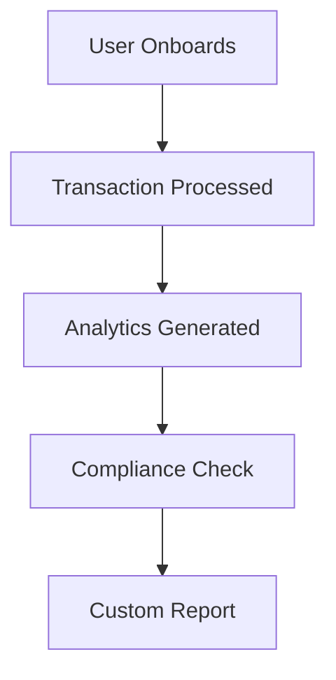

## Overview

Dif provides a comprehensive suite of tools for modern digital banking. You can manage accounts, process transactions securely, ensure compliance, customize services, and leverage analytics for informed decisions. These features integrate seamlessly via APIs at `https://api.example.com`, empowering FinTech innovators to build scalable solutions.

<Callout kind="info">
  All features require an API key. Obtain yours from the [dashboard](https://dashboard.example.com).
</Callout>

## Key Features

Discover the core capabilities through these highlighted areas:

<Columns cols={3}>
  <Card title="Account Management" icon="users" href="#account-management">
    Streamline onboarding and user lifecycle management.
  </Card>
  <Card title="Transaction Processing" icon="trending-up" href="#transactions">
    Handle payments with real-time analytics.
  </Card>
  <Card title="Compliance & Security" icon="shield" href="#compliance">
    Meet regulatory standards effortlessly.
  </Card>
</Columns>

<Columns cols={2}>
  <Card title="Customization" icon="settings" href="#customization">
    Tailor banking services to your needs.
  </Card>
  <Card title="Use Cases" icon="lightbulb" href="#use-cases">
    See Dif in action across FinTech scenarios.
  </Card>
</Columns>

## Account Management and User Onboarding

Manage user accounts from creation to closure with intuitive APIs.

### Onboarding Process

Follow these steps to onboard a new user:

<Steps>
  <Step title="Create Account" icon="user-plus">
    Send a POST request to initiate onboarding.

    <CodeGroup tabs="JavaScript,Python">
      ```javascript
      const response = await fetch('https://api.example.com/v1/accounts', {
        method: 'POST',
        headers: { 'Authorization': `Bearer ${YOUR_API_KEY}` },
        body: JSON.stringify({
          email: 'user@example.com',
          name: 'John Doe'
        })
      });
      ```
      ```python
      import requests
      response = requests.post(
        'https://api.example.com/v1/accounts',
        headers={'Authorization': f'Bearer {YOUR_API_KEY}'},
        json={'email': 'user@example.com', 'name': 'John Doe'}
      )
      ```
    </CodeGroup>
  </Step>
  <Step title="Verify Identity" icon="check-circle">
    Use KYC tools to confirm user details.
  </Step>
  <Step title="Activate Account" icon="unlock">
    Enable full access post-verification.
  </Step>
</Steps>

<ParamField path="email" param-type="string" required="true">
  User's primary email address.
</ParamField>

<ParamField path="name" param-type="string" required="true">
  Full name for account records.
</ParamField>

## Transaction Processing and Analytics

Process transactions efficiently and gain insights with built-in analytics.

### Transaction Views

Switch between views for different insights:

<Tabs>
  <Tab title="Real-time" icon="clock">
    Monitor live transactions.

    ```javascript
    const txs = await fetch('https://api.example.com/v1/transactions?live=true');
    console.log(await txs.json());
    ```
  </Tab>
  <Tab title="Historical" icon="database">
    Query past data for reports.

    ```javascript
    const history = await fetch('https://api.example.com/v1/transactions?from=2024-01-01');
    ```
  </Tab>
  <Tab title="Analytics" icon="bar-chart-3">
    Aggregate metrics.

    ```javascript
    const stats = await fetch('https://api.example.com/v1/analytics/summary');
    ```
  </Tab>
</Tabs>

## Compliance and Security Tools

Dif ensures you stay compliant with automated tools.

<Callout kind="alert">
  Always use HTTPS and rotate `YOUR_API_KEY` regularly to maintain security.
</Callout>

Key security features include:

| Feature | Description |
|---------|-------------|
| Encryption | End-to-end data protection |
| Audit Logs | Track all actions for compliance |
| Fraud Detection | Real-time anomaly alerts |

## Customization Options

Tailor Dif to your banking services:

- **White-labeling**: Customize branding.
- **Workflows**: Build custom approval flows.
- **Integrations**: Connect to third-party services.

```javascript
// Example: Custom workflow
const workflow = await fetch('https://api.example.com/v1/workflows', {
  method: 'POST',
  body: JSON.stringify({ name: 'approval', steps: ['review', 'approve'] })
});
```

## Real-World Use Cases

Explore practical applications:

<ExpandableGroup>
  <Expandable title="Neobank Launch" default-open="true">
    A startup uses Dif for rapid account onboarding and transaction handling, launching in weeks.
  </Expandable>
  <Expandable title="Payment Gateway">
    Process high-volume payments with analytics for fraud prevention.
  </Expandable>
  <Expandable title="Embedded Finance">
    Integrate banking into e-commerce platforms seamlessly.
  </Expandable>
</ExpandableGroup>



<Callout kind="tip">
  Start with [quickstart](/quickstart) to test these features today.
</Callout>