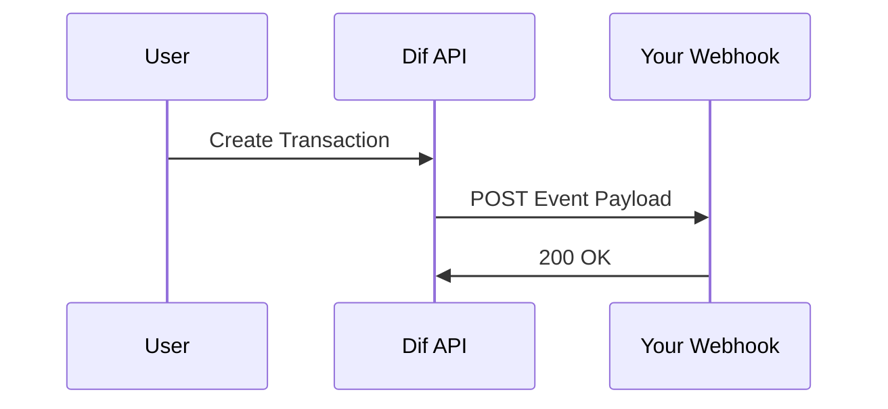

## Overview

Connect Dif to your existing tools and services to streamline financial operations. Use Dif's RESTful API for custom integrations, webhooks for real-time notifications, and pre-built connections to popular payment gateways and apps. This guide covers setup steps, examples, and security best practices.

<Columns cols={3}>
  <Card title="API Integrations" icon="code" href="#api-integrations">
    Build custom connections using Dif's API endpoints.
  </Card>
  <Card title="Payment Gateways" icon="credit-card" href="#payment-gateways">
    Link Stripe, PayPal, and more for seamless payments.
  </Card>
  <Card title="Webhooks" icon="zap" href="#webhooks">
    Receive instant updates on transactions and events.
  </Card>
</Columns>

## API Integrations

Start by generating an API key in your Dif dashboard at `https://dashboard.example.com/settings/api-keys`.

<Callout kind="info">
  Store your `{API_KEY}` securely. Never expose it in client-side code.
</Callout>

Follow these steps to make your first API call.

<Steps>
  <Step title="Authenticate" icon="key">
    Add the `Authorization` header with your Bearer token.
  </Step>
  <Step title="Fetch Data" icon="download">
    Query transactions using the `/v1/transactions` endpoint.
  </Step>
  <Step title="Handle Response" icon="check-circle">
    Parse the JSON response and implement error handling.
  </Step>
</Steps>

<ParamField header="Authorization" param-type="string" required="true">
  Bearer `{YOUR_API_KEY}`
</ParamField>

<ParamField query="limit" param-type="number" required="false">
  Number of results to return (default: `10`, max: `100`).
</ParamField>

```javascript
const response = await fetch('https://api.example.com/v1/transactions?limit=5', {
  headers: {
    'Authorization': `Bearer ${YOUR_API_KEY}`,
    'Content-Type': 'application/json'
  }
});
const data = await response.json();
console.log(data);
```

## Payment Gateways

Connect Dif to leading payment processors using OAuth or API keys.

<Tabs>
  <Tab title="Stripe" icon="dollar-sign">
    <Steps>
      <Step title="Get Stripe Key">
        Retrieve your publishable and secret keys from Stripe dashboard.
      </Step>
      <Step title="Configure Dif">
        Enter keys in Dif dashboard under Integrations > Stripe.
      </Step>
    </Steps>

    <CodeGroup tabs="JavaScript,Python">
      ````javascript
      const stripe = require('stripe')('sk_test_YOUR_STRIPE_SECRET');
      const paymentIntent = await stripe.paymentIntents.create({
        amount: 2000,
        currency: 'usd'
      });
      ````
      ````python
      import stripe
      stripe.api_key = 'sk_test_YOUR_STRIPE_SECRET'
      payment_intent = stripe.PaymentIntent.create(
        amount=2000,
        currency='usd'
      )
      ````
    </CodeGroup>
  </Tab>
  <Tab title="PayPal" icon="paypal">
    Use PayPal's REST API to create orders linked to Dif transactions.
  </Tab>
</Tabs>

## Webhook Configuration

Set up webhooks to receive real-time events like `transaction.created`.

<Request show-lines="true">
  ````javascript
  POST https://api.example.com/v1/webhooks
  {
    "url": "https://your-webhook-url.com/dif-events",
    "events": ["transaction.created", "transaction.failed"],
    "secret": "whsec_YOUR_WEBHOOK_SECRET"
  }
  ````
</Request>



Verify signatures using the shared secret.

```javascript highlight="5-8" show-lines={true}
const crypto = require('crypto');
const sig = req.headers['dif-signature'];
const expectedSig = crypto
  .createHmac('sha256', 'whsec_YOUR_SECRET')
  .update(payload)
  .digest('hex');
if (sig !== expectedSig) {
  throw new Error('Invalid signature');
}
```

<Response tabs="200,400">
  ````json
  {
    "id": "wh_123",
    "url": "https://your-webhook-url.com/dif-events",
    "events": ["transaction.created"]
  }
  ````
  ````json
  {
    "error": "Invalid URL format"
  }
  ````
</Response>

## Popular Third-Party Connections

Dif supports one-click integrations:

| Service       | Use Case                  | Setup Time |
|---------------|---------------------------|------------|
| QuickBooks   | Accounting sync           | 2 minutes |
| Slack        | Transaction notifications | 1 minute  |
| Zapier       | No-code automations       | 3 minutes |

## Best Practices

<ExpandableGroup>
  <Expandable title="Secure Your Integrations" default-open="true">
    Rotate API keys monthly. Use environment variables for `{API_KEY}` storage. Enable IP whitelisting in dashboard.
  </Expandable>
  <Expandable title="Handle Rate Limits">
    Dif enforces `100` requests per minute. Implement exponential backoff on `429` errors.
  </Expandable>
</ExpandableGroup>

<Callout kind="tip">
  Test integrations in sandbox mode first: `https://api-sandbox.example.com`.
</Callout>

Monitor integration health in your Dif dashboard for uptime and error logs.